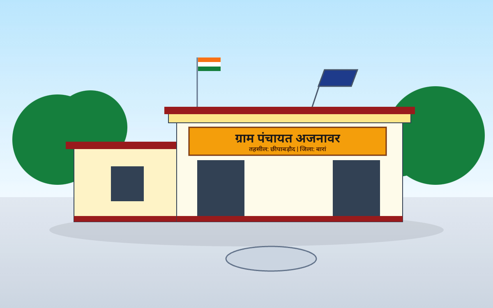

# 🏛️ Gram Panchayat Ajnawar | Digital Citizen Portal
### अधिकृत ई-गवर्नेंस एवं जन-कल्याणकारी डिजिटल पोर्टल • राजस्थान सरकार
**ग्राम पंचायत अजनावर, पंचायत समिति: छीपाबड़ौद, जिला: बारां (राजस्थान) - 325221**

<p align="center">
  
</p>

<p align="center">
  <a href="https://ajnawarpanchayat.github.io"></a>
  <a href="https://rajasthan.gov.in"></a>
  
  
</p>

---

## 🌟 About The Project (परियोजना परिचय)

**Gram Panchayat Ajnawar Digital Portal** ग्रामीण भारत के सशक्तिकरण और ई-गवर्नेंस को ज़मीनी स्तर तक पहुँचाने के लिए विकसित किया गया एक आधुनिक, तीव्र और सुरक्षित वेब प्लेटफ़ॉर्म है। 

यह पोर्टल ग्राम पंचायत प्रशासन (सरपंच, उपसरपंच, ग्राम विकास अधिकारी, पटवारी व वार्ड पंच) और आम नागरिकों के बीच पारदर्शिता, त्वरित सूचना प्रसारण और नागरिक लोक सेवा गारंटी (Grievance Redressal) को पूरी तरह डिजिटल माध्यम से उपलब्ध कराता है।

---

## 🚀 Key Features (प्रमुख विशेषताएँ)

* 📢 **नवीन सरकारी आदेश व प्रेस नोट (News & Events):** 
  * लाइव टिकर एवं स्क्रोलिंग घोषणाएँ।
  * डिजिटल डिस्पैच नंबर, दिनांक एवं अधिकृत कार्यालय मुहर के साथ ई-दस्तावेज़ प्रिव्यू और 1-क्लिक प्रिंटिंग।
* 👥 **प्रतिनिधि एवं वार्ड पंच डायरेक्टरी:** 
  * सरपंच, उपसरपंच, VDO, पटवारी एवं सभी 11 वार्ड पंचों की आधिकारिक सूची।
  * **2-कॉलम कॉम्पैक्ट रिस्पॉन्सिव मोबाइल ग्रिड** के साथ त्वरित 1-क्लिक कॉलिंग सुविधा।
* 🏗️ **पारदर्शिता विकास डैशबोर्ड (Works & Projects):** 
  * पंचायत में स्वीकृत, प्रगतिशील एवं पूर्ण विकास कार्यों का बजट, वित्तीय वर्ष एवं मद-वार लाइव विवरण।
* 📝 **ऑनलाइन नागरिक समस्या निवारण (लोक सेवा गारंटी):** 
  * वार्ड-वार (1 से 11) नागरिक शिकायत पंजीकरण प्रणाली।
  * यूनिक टोकन (`AJN-XXXX`) द्वारा लाइव ट्रैकिंग।
  * 7 से 15 कार्य दिवस निस्तारण गारंटी एवं डिजिटल पावती रसीद प्रिंटिंग।
* 💬 **डिजिटल नागरिक सहायता केंद्र (Live Helpdesk):** 
  * Tawk.to JavaScript API आधारित ज़ीरो-फ़्लिकर कस्टम चैट सपोर्ट।
  * सरकारी नेवी ब्लू (`#003366`) थीम, प्री-चैट फ़ॉर्म (नाम, मोबाइल नंबर, वार्ड चयन) एवं ऑटो-क्लोज़ ऑफ़कैनवास मेनू।
* 🖼️ **कार्य एवं गतिविधि गैलरी:** 
  * ग्रामीण निर्माण, स्वच्छता अभियान और पंचायत कार्यक्रमों की मोबाइल-फ्रेंडली 2-कॉलम फ़ोटो गैलरी।
* 🔗 **एकीकृत नागरिक ई-सेवाएँ (One-Stop Links):** 
  * पहचान पोर्टल (जन्म / मृत्यु / विवाह प्रमाण पत्र)
  * जन आधार एवं आधार डिजिटल सेवाएँ
  * अपना खाता (जमाबंदी / ई-धरती / भू-नक्शा)
  * राशन कार्ड (RRCC) व सामाजिक सुरक्षा पेंशन / पालनहार
  * आधिकारिक व्हाट्सएप सूचना बुलेटिन चैनल

---

## 🔒 Enterprise Security & Administration (प्रशासनिक सुरक्षा)

* **Supabase Cloud Backend:** PostgreSQL पर आधारित Row-Level Security (RLS) एवं एन्क्रिप्टेड क्रेडेंशियल्स।
* **Role-Based Access Control (RBAC):**
  * `Developer / IT Nodal`
  * `Sarpanch (सरपंच)`
  * `VDO (ग्राम विकास अधिकारी)`
* **Direct RPC Credentials Management:** बिना ईमेल रिकवरी निर्भरता के इन-ऐप सुरक्षित पासवर्ड रीसेट व्यवस्था।
* **Audit & Session Logging:** लोकलस्टोरेज बफ़र सिंक्रोनाइज़ेशन के साथ लॉगिन व डेटा संशोधन की लाइव ऑडिट हिस्ट्री।
* **Data Backup & Restore:** सिंगल-क्लिक JSON सिस्टम बैकअप और डेटा रिस्टोर सुविधा।

---

## 🛠️ Tech Stack (तकनीकी संरचना)

| Layer | Technologies Used |
| :--- | :--- |
| **Frontend UI** | HTML5, CSS3, Bootstrap 5.3.3, FontAwesome 6.5.1 |
| **Typography** | Tiro Devanagari Hindi, Yantramanav, Plus Jakarta Sans |
| **Dynamic Logic** | Modular Vanilla JavaScript (ES6+), Supabase JS Client v2 |
| **Live Helpdesk** | Tawk.to JavaScript API (Zero-Flicker Hidden-Launcher Mode) |
| **Database & Auth** | Supabase (PostgreSQL, Stored Procedures / RPCs, Auth Engine) |
| **CDN & Edge Hosting** | GitHub Pages (`ajnawarpanchayat.github.io`) / Cloudflare Pages |

---

## 📂 Project Structure (फ़ाइल संरचना)

```text
panchayat-portal/
├── index.html           # मुख्य वेब पोर्टल (Complete Responsive Government Portal)
├── config.js            # Supabase API keys & endpoint credentials
├── 404.html             # कस्टम 404 नॉट फ़ाउंड पृष्ठ
├── 404.css              # 404 एरर पेज स्टाइलिंग
├── 404.js               # 404 स्मार्ट रीडायरेक्शन
├── README.md            # परियोजना दस्तावेज़ (Documentation)
├── js/
│   ├── app.js           # मुख्य डायनामिक रेंडरिंग व डेटाबेस इंटरेक्शन
│   ├── auth.js          # रोल-बेस्ड एडमिन ऑथेंटिकेशन व पासवर्ड मैनेजमेंट
│   └── logger.js        # क्लाउड ऑडिट लॉगिंग व हिस्ट्री ट्रैकर
└── images/
    └── brand/           # आधिकारिक मुहर, पंचायत लोगो एवं बैनर इमेजेस

```

---

🏛️ Administrative & Nodal Desk
​कार्यालय: ग्राम पंचायत भवन, ग्राम व डाकघर: अजनावर, तहसील: छीपाबड़ौद, जिला: बारां (राज.) - 325221
​आधिकारिक ईमेल: contact.ajnawar@gmail.com
​नोडल अधिकारी / डिजिटल हेल्पडेस्क प्रभारी: कुलदीप (IT Executive)
​तकनीकी सपोर्ट ईमेल: developer.ajnawar@gmail.com
​📬 Developer Connect
​<p align="left">
<a href="mailto:kuldeep7037k@gmail.com"></a>
<a href="https://t.me/kuldeepchouhan15"></a>
<a href="https://github.com/Kuldeepbheel15"></a>
<a href="https://www.linkedin.com/in/kuldeepchouhan012"></a>
</p>
​<div align="center">
<sub>Designed & Developed with ❤️ by <b><a href="https://github.com/Kuldeepbheel15">Kuldeep Chouhan</a></b></sub>


<sub><b>सशक्त गाँव • डिजिटल अजनावर</b></sub>


<sub>© 2026 Gram Panchayat Ajnawar • All Rights Reserved</sub>
</div>
